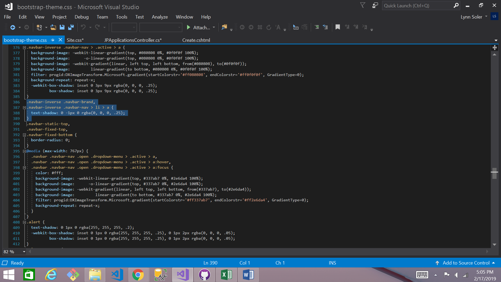

# Live Project: Job-Placement-Dashboard
Azure DevOps - Remote Collaboration Project

## Introduction
For the last two weeks at The Tech academy, I worked as a Remote Developer on a 6-Member Development Team for Prosper IT Consulting, LLC. We all worked to build off of an existing, MVC-C# Web Application Program (using the Code-First Entity Framework) that was mid-cycle in its development. This was a great learning experience for New Code Implementation + Debugging in Visual Studio on a much larger scale, as well as Development Collaboration, while at the direction of a Project Manager in Azure DevOps and Slack. 

Below are descriptions and screenshots (SS) of the stories I worked on during our sprint.

## Front-End Stories
### Style Changes to Navbar

Product Backlog Item 3660: 
I was referred to another website with similar Navbar styles that the client wanted implemented into their Navbar. I was instructed to use the exact color #Blue Backround + #Orange Text as was seen on the 'donor' site. Quick Eye Dropper Google extension gave me the color codes to apply to the Site.css file. The background color change to #Blue was then as simple as changing the color code in the Site.css file, however the text color within the Navbar constraint proved a bit more challenging to locate. I tested new class and id creations in the project's Layout.cshtml & created the appropriate styling syntax in Site.css to test if my approach would be return successful on the intended target. The #Orange text returned correctly now in the browser, but it lost the white hover effect. After further inspection in the DevTools Console, I was able to locate the arching stack controlling the Navbar text style that was lost in my new class & ID creation thru the arching Site.css file I tested previously. 

Using the syntax found in the bootstrap-theme.css file, I applied the same class to the Site.css file + the appropriate #Orange color change that would then, arch the bootstrap file with the correct #Orange text + white inverse text property.

## Back-End Stories
### GUID Implementation

Product Backlog Item 3585: 
In the JPApplication Create view, I was instructed to remove the Student_id from the view. I completed this task with simply commenting out the code. I felt it best-practice (& especially for a mid-cycle Web Application build) to keep the pre-existing code in the event that it was found to be an integral piece of the application build at a later time, or perhaps, even a useful piece to another developer.

Next, I was instructed to add the id of the current user to the JPstudent object before it was saved to the database. After some simple, yet extremely mission-critical clarification exchanged with the Project Manager, I understood that the purpose of this story was to assign the student's id to the application before it was saved to the database--without the student knowing what their id is. This allowed me to complete the task by assigning a GUID to the Application object that contained the student_id property.

